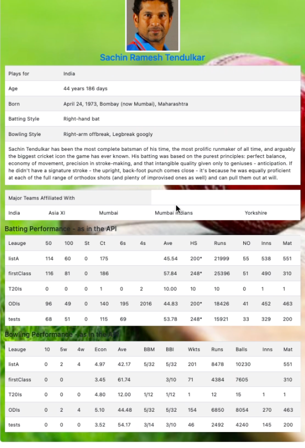

# Website-using-crick-api
This website is build to check player statistics with their id using crick api.

## TechStack:
1. HTML
2. CSS
3. Bootstrap
4. Javascript
5. JQuery
6. Ajax
(Data fetched in Json form)

#### About Crick Api:
You can find all about crick api [Crick Api](https://www.cricapi.com)
##### Steps to get the key:
1. Go to the website
2. Sign Up
3. Enjoy your free key for sometime and if you want to work more, you can buy it.

*Developed by Archana Kumari*

> for any query contact at arkumari@gmail.com

